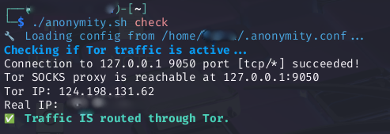
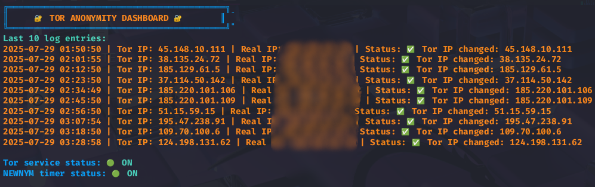

# Tor Anonymity Toolkit


A simple, powerful, and user-friendly Bash toolkit to help you manage **Tor identity rotation**, **traffic monitoring**, and **service control** — all from your terminal.

<p align="center">
  
</p>

---

## 📦 Installation

### 1. Clone this repository

```bash
git clone https://github.com/Hao-Tec/tor-anonymity-toolkit.git
cd tor-anonymity-toolkit
```

### 2. Make the script executable

```bash
chmod +x anonymity.sh
```

### 3. Run the setup script (auto-creates timer/service)

```bash
./anonymity.sh setup
```

---

## ⚙️ Configuration

After first run, a config file will be auto-generated at:

```bash
~/.anonymity.conf
```

Default contents:

```bash
# ~/.anonymity.conf

# Tor control port password
AUTH_PASSWORD="ACILAB"

# Enable desktop notifications (1 = yes, 0 = no)
ENABLE_NOTIF=1

# Interface theme (light or dark)
THEME="dark"
```

You can manually edit this file anytime.

---

## 🧠 Features

* ✅ Toggle Tor and NEWNYM services
* 🔁 Auto IP rotation every 10 minutes
* 🧪 Real-time Tor traffic check
* 📊 Terminal dashboard with IP logs
* 🔔 Desktop notifications on IP change
* 🌃 Dark/light theme support
* 🛠 One-command setup for systemd timers

---

## 🚀 Usage

### Menu Mode

```bash
./anonymity.sh
```

### Command Mode

```bash
./anonymity.sh <command>
```

| Command         | Description                            |
| --------------- | -------------------------------------- |
| `toggle`        | Toggle both Tor and NEWNYM services    |
| `toggle-tor`    | Toggle only Tor                        |
| `toggle-newnym` | Toggle only NEWNYM                     |
| `enable`        | Enable both services                   |
| `disable`       | Disable both services                  |
| `restart`       | Restart both services                  |
| `newnym`        | Manually send NEWNYM signal            |
| `check`         | Test if traffic is routed through Tor  |
| `dashboard`     | Show last 10 Tor IP logs               |
| `monitor`       | Live IP monitor (Ctrl+C to stop)       |
| `setup`         | First-time systemd timer/service setup |
| `status`        | Show current service status            |
| `help`          | Show help message                      |

---

## 🌃 Themes

The UI supports both **light** and **dark** color schemes.

To change it:

* Via config file:

  ```bash
  THEME="light"
  ```

* Or at runtime:

  ```bash
  ./anonymity.sh --theme=light
  ```

---

## 🔧 Dependencies

Install required packages:

```bash
sudo apt install tor curl nc expect telnet systemd notify-osd
```

> ⚠️ For full functionality, make sure `tor` is properly installed and your system supports `systemctl --user`.

---

## 📸 Screenshots

### 🧭 Interactive Menu
A sleek terminal UI for managing Tor anonymity features.


---

### 🔍 Check Traffic via Tor
Quick verification of whether your internet traffic is routed through Tor.



---

### 📊 Anonymity Dashboard
Displays the latest logs, IP history, and service statuses in a visually helpful format.



---

### ⚙️ Systemd Setup Automation
Auto-creates the required service and timer files with a single command.


---

## 🛡 Security Tips

* Do **not share** your `.anonymity.conf` file publicly.
* Restrict permissions:

```bash
chmod 600 ~/.anonymity.conf
```

---

## 🤝 Contributing

Pull requests and issue reports are welcome!

👉 [https://github.com/Hao-Tec/tor-anonymity-toolkit](https://github.com/Hao-Tec/tor-anonymity-toolkit)

---

## 📄 License

 MIT License © 2025 [Hao-Tec](https://github.com/Hao-Tec)

---

## 🙌 Author

Made with ❤️ by [Hao-Tec](https://github.com/Hao-Tec)
